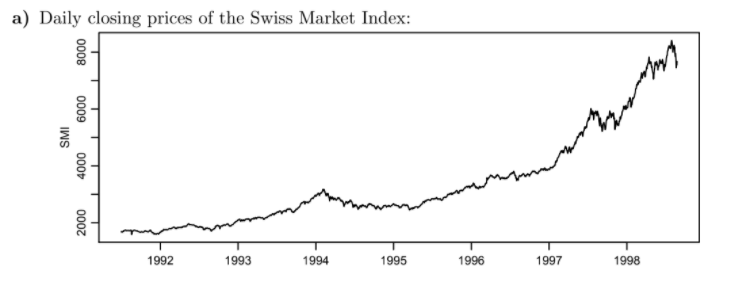
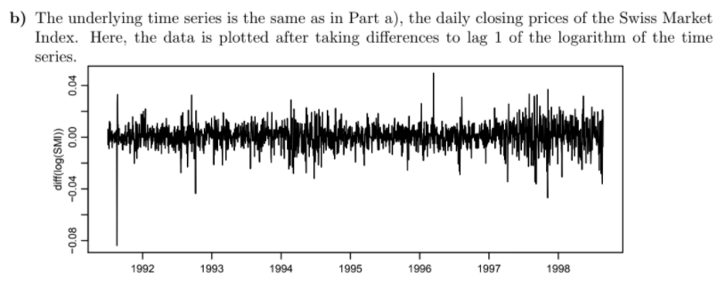
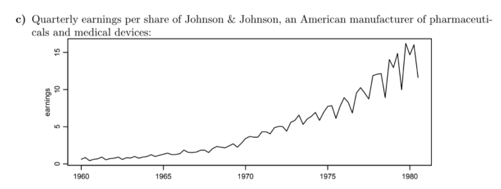
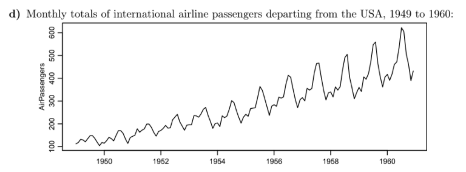
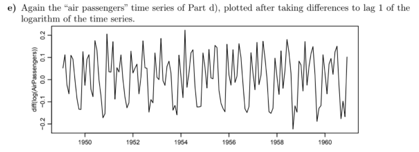
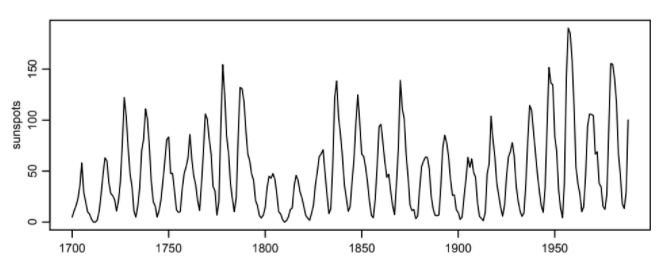
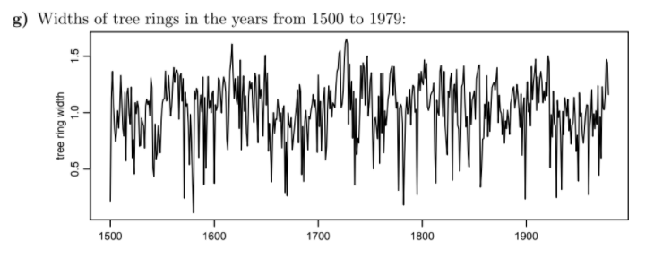
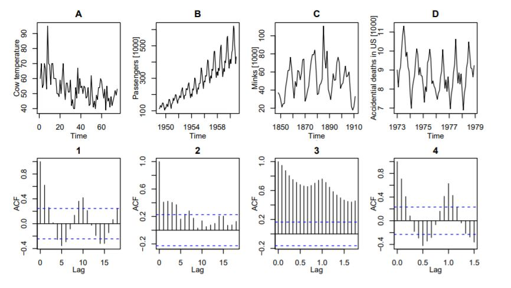

```{r setup, include=FALSE}
knitr::opts_chunk$set(echo = TRUE)
```

# Series 1

## Exercise 1.1
What is the expected period (time period of repetition) and the time step for the following timeseries:
```{r, eval=F}
dat = floor(runif(n= 1000, min = 1, max= 2000))
```

a) Sunshine duration per month in Basel from 1990 to 2000
```{r, eval =F}
ts(data = dat, start=c(1990,1),end=c(2000,12), frequency = 12)
```

b) Number of newborn babies in the city of Zurich per year from 2000 to 2011
```{r, eval =F}
ts(data=dat, start=2000,end=2011,frequency = 1)
```

c)Number of reservations in a restaurant for every night during 4 weeks
```{r, eval = F}
ts(data=dat, start=1,end=4,frequency = 7)
```

d) Water runoff of a river. The data has been collected every day for 4 years
```{r, eval = F}
ts(data=dat, start=1,end=4,frequency = 365)
```

## Exercise 1.2
Using the data hstart.dat, we illustrate various methods for descriptive decomposition and elimination of trends. The data contains monthly data on the start of residential construction in the USA within the time frame of January 1966 to December 1974. The data have undergone some transformation unknown to us (perhaps an index over some baseline value has been calculated, or perhaps the data are to be read as x · 10^? construction permits).

```{r}
hstart <- read.table('https://stat.ethz.ch/Teaching/Datasets/WBL/hstart.dat')
head(hstart)
```

Make a time series plot. Is this a stationary time series? If not, what kind of nonstationarity is evident?

```{r}
ts.plot(hstart, lwd = 1.5, main = 'hstart - residential construction in the USA dataset')
```
not stationary, with periodic pattern and a small trend

## Exercise 1.3
Simulate timeseries according to the following models:
```{r, eval =F}
set.seed(100)
Et <- ts(rnorm(101, 0, 1))
Et [1] <- 0
y1 <- 0

for (i in 2:length(Et)) {
  y1[i] <- Et[i]
  }

y1 <- y1[2:length(y1)]
ts.y1 <- ts(y1)
```

a) Y1: Yt = Et − 0.5 · Et−1 , where Et ∼ N(0, 1) i.i.d. E0 = 0
```{r, message=F, warning=F, error =F}
set.seed(100)
Et <- ts(rnorm(101,0,1))
Et [1] <- 0
y1 <- 0
for (i in 2:length(Et)) {
  y1 [i] <- Et[i] - 0.5 * Et[i-1]
}

y1 <- y1[2:length(y1)]
ts.y1 <- ts(y1)

plot(ts.y1, lwd = 1.5, main = 'Y1: Yt = Et − 0.5 · Et−1 , where Et ∼ N(0, 1) i.i.d. E0 = 0')
```

b)Y2: Yt = Yt−1 + Et, where Et ∼ N(0, 1) i.i.d. Y0 = 0
```{r}
set.seed(100)
Et <- ts(rnorm(100,0,1))
y2 <- 0
for (i in 2:length(Et)) {
  y2[i] <- y2[i-1] + Et[i]
}

ts.y2 <- ts(y2)

plot(ts.y2, main = 'Y2: Yt = Yt−1 + Et, where Et ∼ N(0, 1) i.i.d. Y0 = 0', lwd = 1.5)
```

c) Y3: Yt = 0.5 · Yt−1 + Et, where Et ∼ N(0, 1) i.i.d. Y0 = 0
```{r}
set.seed(100)
Et <- ts(rnorm(100,0,1))
y3 <- 0
for (i in 2:length(Et)) {
  y3[i] <- 0.5 * y3[i - 1] + Et[i]
}

ts.y3 <- ts(y3)

plot(ts.y3, lwd = 1.5, main= 'Y3: Yt = 0.5 · Yt−1 + Et, where Et ∼ N(0, 1) i.i.d. Y0 = 0')
```

d) Y4: Yt = Yt−1 · Et, where Et ∼ U(0.95, 1.05) i.i.d. Y0 = 1
```{r}
set.seed(100)
Et <- ts(runif(100,0.95, 1.05))
y4 <- 1
for (i in 2:length(Et)) {
  y4[i] <- y4[i-1] * Et[i]
}

ts.y4 <- ts(y4)

ts.plot(ts.y4, main ='Y4: Yt = Yt−1 · Et, where Et ∼ U(0.95, 1.05) i.i.d. Y0 = 1', lwd = 1.5)
```

## ETH Exercises

### 1.3 
Have a look at the following set of time series. For every series, shortly answer the following questions
(motivate your answers):
• Is the time series stationary?
• Is there a trend?
• Can one find some seasonal effect? If yes, what is the period?
• Which transformation should be applied (if required)?

```{r, echo=FALSE, fig.cap="plots and correlograms", out.width = '100%'}

```

Answer: 
- non stationary
- non linear trend, mostly increasing 
- no seasonal component
- log transformation:  diff()

```{r, echo=FALSE, fig.cap="plots and correlograms", out.width = '100%'}

```

Answer: 
- seems stationary
- trend from before was removed by diff(difference = 1)
- constant variance achieved by taking the logarithm. However Log-Returns are NOT stationary, because of volatility clusters

```{r, echo=FALSE, fig.cap="plots and correlograms", out.width = '100%'}

```

Answer:
- non stationary
- exponential increasing trend
- seasonal component with period 1 year
- log transformation with diff() to get additive components

```{r, echo=FALSE, fig.cap="plots and correlograms", out.width = '100%'}

```

Answer:
- non stationary
- increasing trend
- seasonal component with period 1 year and increasing variance
- log transformation with diff()

```{r, echo=FALSE, fig.cap="plots and correlograms", out.width = '100%'}

```

Answer:
- non stationary
- no visible trend
- seasonal effect with period 1 year

Yeary numbers of sunspots:
```{r, echo=FALSE, fig.cap="plots and correlograms", out.width = '100%'}

```

Answer:
- likely to be stationary
- no trend
- no seasonal effect
- periodicity with period of 11 years
- variance maybe different over time
- log transformation required due to right skewnes

```{r, echo=FALSE, fig.cap="plots and correlograms", out.width = '100%'}

```

Answer:
- probably stationary
- no clear trend visible
- no seasonal effect visible

# Series 2

## Exercise 2.1
Remove the linear trend by applying backward differencing on timeseries created
from the following models:

a) Xt ∼ 0.5t + 1 + Ut, where Ut ∼ U(−1, 1)
```{r,warning=F,error=F}
t <- seq(1,100,length =100)
Ut <- runif(100,-1,1)
data <- 0.5 * t + 1 + Ut
ts.data <- ts(data)

plot(ts.data)

yt <- diff(ts.data)

#comparison of data length
length(ts.data)
length(yt)

plot(yt, lwd = 1.5, main = 'Xt ∼ 0.5t + 1 + Ut, where Ut ∼ U(−1, 1)')
```

b) Xt ∼ 2t^2 + 3t − 1 + Ut, where Ut ∼ U(−200, 200)
```{r, warning=F,error=F}
t <- seq(1, 100, length=100)
Ut <- runif(100, -200, 200)
data <- 2 * t^2 + 3 * t - 1 + Ut
ts.data <- ts(data)

plot(ts.data)

yt <- diff(ts.data, differences = 2)

#comparison of length
length(ts.data)
length(yt)

plot(yt, lwd = 1.5, main = 'Xt ∼ 2t^2 + 3t − 1 + Ut, where Ut ∼ U(−200, 200)')
```


## Exercise 2.2
We reconsider the data set from exercise 1.2 about residential construction in the USA
from January 1966 to December 1974.
```{r}
hstart <- read.table('https://stat.ethz.ch/Teaching/Datasets/WBL/hstart.dat')
head(hstart)
ts.hstart <- ts(hstart[,1], start = c(1966,1), frequency = 12)
ts.hstart
```

a) Decompose the time series in trend, seasonal component and remainder using
the non-parametric STL method, and plot the results.
```{r}
hstart.stl <- stl(ts.hstart, s.window = 'per')

plot(hstart.stl, lwd = 1.5, col = 'red')
```

b) The special filter Yt = 1/24 (Xt−6 + 2Xt−5 + ... + 2Xt + ... + Xt+6) can be used for
computing a trend estimate. Plot this, the STL trend and the data in a single
plot. What are the differences between the two methods?
```{r}
weights <- c(1, rep(2,11), 1)/24 # total of 13 values because t-6 unti t+6
weights

hstart.filtertrend <- filter(ts.hstart, filter = weights, sides = 2)
hstart.stl <- stl(ts.hstart, s.window = 'per')

plot(ts.hstart, lwd = 2, main = 'hstart data  with trend lines (filter and stl)')
lines(hstart.filtertrend, col = 'red', lwd = 2)
lines(hstart.stl$time.series[,'trend'], col = 'green', lwd = 3, lty = 2)
legend('topleft', legend = c('data', 'filter', 'stl'), lty = 1:2, col = c('black', 'red', 'green'), cex = 0.8)
```

c) Try to remove the trend and seasonal effects by computing differences. After
removing seasonal effects, choose some linear trend elimination method and
plot the outcome.
```{r}
hstart.adj.season <- diff(ts.hstart, lag = 12, differences = 1)
plot(hstart.adj.season, lwd = 2, main = 'hstart data after removing seasonal pattern')
```
A trend is still visible, eliminate it with backward differencing once more to
produce a stationary time series.

```{r}
hstart.adj.trend <- diff(hstart.adj.season, lag = 1)
plot(hstart.adj.trend, lwd = 2, main = 'hstart dataset after eliminating season and trend effects')
```


## Exercise 2.3
To test ideas and algorithms, R comes with built-in data sets. The data used in this
exercise is called co2 and contains atmospheric concentrations of CO2 in parts per
million.
```{r}
data(co2)
class(co2)
plot(co2, main = 'co2 data', lwd = 1.5)
```

Use backward differencing on the co2 data to abolish the seasonality effect. Figure
out what value for the lag is to choose for an optimum reduction of the seasonality?
What happens if you choose other values for the lag?
```{r}
co2.adj.season <- diff(co2, differences = 1, lag = 12)
plot(co2.adj.season, lwd = 1.5, main = 'co2 dataset after eliminating seasonal pattern with diff = 1, lag =12')
```
```{r}
co2.adj.bd <- diff(co2.adj.season, lag = 1, differences = 1)
plot(co2.adj.bd, lwd = 1.5, main = 'co2 dataset after eliminating seasonal pattern with diff = 1, lag =12 and diff = 1, lag = 1')
```


## Exercise 2.4
Once again have a look at the co2 data set. In this exercise you should
try to decompose the series into trend, seasonality and random parts using a linear
additive filter. For the seasonal part, the hints below should help you calculate the
means over the same months in different years.

TREND ESTIMATION - Attention: if the freqeuncy is even, we have to split take half of the
border months if we want to end up with a symmetric window.
```{r}
co2.data <- co2
weights <- c(0.5, rep(1,11), 0.5)/12
trend <- filter(co2.data, filter = weights, sides = 2)
plot(co2.data, lwd= 2, main = 'co2 decomposition with linear additive filter - TREND ESTIMATION')
lines(trend, col= 'red', lwd = 2.5)
```

SEASONALITY ESTAMINATION
```{r}
weights <- c(0.5, rep(1,11), 0.5)/12
trend.est <- filter(co2, filter = weights, sides = 2)
trend.adj <- co2 - trend.est
month <- factor(rep(1:12, 39))

season.est <- tapply(trend.adj, month, mean, na.rm = T)
plot(season.est, type = 'h', xlab = 'Month', main = 'co2 decomposition with linear additive filter - SEASON ESTIMATION', col = 'red')
abline(h = 0)
```

For a combined solution have a look at the decomopose() function:
```{r}
co2.data <- co2
co2.data.decomp <- decompose(co2.data)
plot(co2.data.decomp, lwd = 1.5, col = 'red')
```


# Series 3

## Exercise 3.1
Below you find the plots and the correlograms of four datasets. The correlograms have been permutated. Please find for each data sets (A-D) the appropriate corellogram
(1 - 4).
```{r, echo=FALSE, fig.cap="plots and correlograms", out.width = '100%'}

```
Solution:
A - 2
B - 3
C - 1
D - 4


## Exercise 3.2
Let us now consider the electricity production of Australia in GWh in the period from
January 1958 to December 1990. You may download the data from
http://stat.ethz.ch/Teaching/Datasets/WBL/cbe.dat.

The aim of this exercise is to compare the effect of different algorithms to decompose
a time series representation in trend, seasonality and remainder by means of their
(partial) autocorrelation function.
```{r}
data <- read.table('cbe.dat', header = T)
head(data)
ts.elec <- ts(data[,'elec'], start = c(1958,1), end = c(1990, 12), freq= 12)
head(ts.elec)
```

a) Start by considering the plot of the time series. Why is not meaningful to interpret the correlogram of this time series?
Explain in a few sentences.
```{r}
plot(ts.elec, lwd = 1.5)
```
Answer: The time series displays a clear trend and a clear seasonality effect. Therefore,
the fundamental assumption of the autocorrelation function analysis (stationarity) is violated.


Basic Structures
The following two structures are considered for basic decomposition models:
Additive: Xt = Trend + Seasonal + Random
Multiplicative: Xt = Trend * Seasonal * Random

b) Decompose the time series into trend, seasonal component and remainder using
the R function decompose(), which performs the decomposition with moving
averages.
```{r}
# How to Choose Between Additive and Multiplicative Decompositions
#The additive model is useful when the seasonal variation is relatively constant over time.
#The multiplicative model is useful when the seasonal variation increases over time.

elec.decomp <- decompose(ts.elec, type = 'multiplicative')
plot(elec.decomp)
```

Plot the remainder (random) and its correlogram (acf) and interpret the plots in a few
sentences.
The function employs a filter to estimate the trend; therefore, the first and the
last few entries of the decomposition are not defined, i.e. the have the value NA
in R. To prevent issues of R, the parameter na.action = na.pass (asking R
to ignore NA entries) has to be employed.
```{r}
plot(elec.decomp$random, ylab = 'remainder')
acf(elec.decomp$random, na.action = na.pass, plot= T, ylim = c(-1,1))
```
Answer: The trend is removed from the time series, but we still see a periodic behaviour in the computed remainder. The period of one year equals that of the seasonal component of the original time series. These effects are also visible in the damped oscillatory behaviour of the correlogram.


c) Decompose the log-transformed time series using the R function stl(). Estimate the seasonal effect once by averaging over all years (parameter s.window = "periodic") and once by choosing an appropriate smoothing window (parameter s.window = ...). Recall that the window length has to be odd. An appropriate smoothing window may be determined by the R-function monthplot().
For both estimation approaches (averaging and smoothing window), plot the
remainder and its correlogram, and comment on the plots.
```{r}
elec.stl <- stl(log(ts.elec), s.window = 'per')
plot(elec.stl)
plot(elec.stl$time.series[,'remainder'], ylab = 'remainder')
acf(elec.stl$time.series[,'remainder'], plot= T, ylim =c(-1,1))
```
Answer: The result are compatible with the those of decompose(). The remainder displays still a periodic behaviour with a period of one year.

```{r}
a.05 <- stl(ts.elec, s.window = 5)
monthplot(a.05)
a.13 <- stl(ts.elec, s.window= 13)
monthplot(a.13)
a.16 <- stl(ts.elec, s.window = 16)
monthplot(a.16)
a.19 <- stl(ts.elec, s.window = 19)
monthplot(a.19)
a.23 <- stl(ts.elec, s.window = 23)
monthplot(a.23)
```
Using a smoothing window of 19 (the size is chosen based on the monthplot; other values of similar magnitude yield comparable results), we find the following picture:
```{r}
elec.stl.w19 <- stl(log(ts.elec), s.window = 19)
plot(elec.stl.w19)
plot(elec.stl.w19$time.series[,'remainder'], ylab= 'remainder')
acf(elec.stl.w19$time.series, plot = T, ylim = c(-1,1))
acf(elec.stl.w19$time.series[,'remainder'], plot = T, ylim = c(-1,1))
```
Findings: Now, the periodicity is removed much better from the time series. The autocorrelation function of the remainder at lag 1 is not significant any more.
The difference between the averaging and the smoothing window approach goes along with different concepts behind the two methods.
In the averaging approach, we model the seasonal component as truly periodic and explain the slight deviations from this fitted component as a stationary random process, which in our case has the same periodicity as the underlying seasonal effect.

In the smoothing window approach, we allow the seasonal component to vary (slightly) over time, which enables to eliminate the effects with the frequency of the seasonal 4 component in the remainder. On the other hand, this approach is more prone to overfitting, since the slight deviations from a truly periodic behaviour in the seasonal component are interpreted as deterministic".


d) Explain why you used the parameter type = "multiplicative" in Task b), and why you log-transformed the time series before performing an stl()decomposition in Task c).

The seasonal oscillations of the time series (see plot in Task a)) are approximately proportional to the trend. Therefore, a multiplicative model is appropriate
for describing the time series:
Xt = mt * St * Rt
A log-transformation transforms a multiplicative into an additive model:
log(Xt) = log(mt) + log(St) + log(Rt)

The R function decompose() can handle multiplicative models directly, whereas stl() requires the reduction to an additive model


e) As a last algorithm consider the differencing approach. Choose a lag of 1 and 12(months) to eliminate trend and periodic structures. 
```{r}
elec.diff12 <- diff(ts.elec, lag = 12)
elec.diff12.1 <- diff(elec.diff12, lag = 1)
```

Plot the resulting time series and autocorrelation function. Compare the results to the previous methods.
```{r}
plot(elec.diff12.1)
acf(elec.diff12.1, ylim = c(-1,1))
```
Findings: The acf looks quite different. We have strong negative autocorrelation at lag 1 and 12. Therefore, the model is probably not linear. This method is not appropriate here.


## Exercise 3.3
In this exercise, we will calculate the lagged scatter plot and the plug-in estimator without employing the internal R function.

a) Write a function to calculate the lagged scatter plot estimator for the autocorrelation. For this, you may extend the code given in the lecture notes.
```{r}
lagged <- function(data) {
n <- length(data)
lagCorrel <- rep(0, n)
for (i in 0:(n - 1)) {
lagCorrel[i + 1] = cor(data[1:(n - i)], data[(i +
1):n])
}
# return value
lagCorrel
}
```

b) Develop a function to calculate the plug-in estimator for the autocorrelation.
For the implementation of the plug-in estimator we calculate the individual defining γ(k) factors first and then assign the fraction of γ(k)/γ(0) to the estimator ρˆ(k):
```{r}
plugIn <- function(data) {
n <- length(data)
meanData <- mean(data)
deltaX <- data - meanData
gamma0 = sum(deltaX * deltaX)/n
plugIn <- rep(0, n)
for (i in 0:(n - 1)) {
gammaK = sum(deltaX[(i + 1):n] * deltaX[1:(n -
i)])/n
plugIn[i + 1] <- gammaK/gamma0
}
plugIn
}
```

c) Calculate the two estimates for the beer and the chicken dataset. The beer
and the chicken dataset is contained in the "fma"package. In case it is not already loaded, one can load it with the command library(fma).
```{r, message = F, error= F}
library(fma)

lagChicken <- lagged(beer)
plugChicken <- plugIn(beer)
plot(lagChicken, type = "l", ylab = "ACF Estimator")
lines(plugChicken, col = "red")
```

```{r}
lagChicken <- lagged(chicken)
plugChicken <- plugIn(chicken)
plot(lagChicken, type = "l", ylab = "ACF Estimator")
lines(plugChicken, col = "red")
```
The beer data sets displays a high agreement between the two calculation methods, whereas the chicken data sets displays a strong disagreement between the two data sets.


# Series 4

## Exercise 4.1
In this exercise, we would like to investigate the properties of an AR(1) process.

a) Simulate a realisation of the process
Xt = 0.8 · Xt−1 + et
with et an innovation process of length 1000.
```{r}


```

b) Calculate the theoretical autocorrelation function and the plug-in estimator of
the autocorrelation of the simulation results in a) and plot both curves for lags
from 0 to 100.
```{r}

```

c) What is the functional dependence of the theoretical autocorrelation function
on the lag k and α1 = 0.8?
```{r}

```

d) Now compare the theoretical partical autocorrelation function with the estimated version for the simulated process. Which particularity do you observe for the two representations?
```{r}

```


# Exercise 4.2
An analytical device measures the creatine concentration of human muscular tissue.
In this exercise, we would like to check whether it is operating correctly, i.e. the measured values does not depend on the measuring instance.

A sample with known concentration is split into 157 samples and measured by the
device one after the other. You can find them in the data under
http://stat.ethz.ch/Teaching/Datasets/WBL/kreatin.dat.
In this exercise, we focus only on the variable "gehalt"(content) in the data.

a) Which stochastic model should this series of data follow if the machine is working correctly?
```{r}

```

b) Use the time series plot, the autocorrelations (and the partial autocorrelations)
to determine whether these data fit the ideal model found in Part a) or not.
```{r}

``` 


# Exercise 4.3
In this exercise, we consider two time series ts1 and ts2, which putatively were
created by an AR process. You may download the data from
http://stat.ethz.ch/Teaching/Datasets/WBL/ts_S3_A2.dat

a) Visualise both time series. Are both time series stationary? What is their mean?
```{r}

```

b) Consider the (partial) autocorrelation function and decide whether the two time series can be generated by an AR process. If yes, what is the order of the
respective AR process?
Hint: The partial auto correlation function of an AR(p) process displays a sudden drop for lags larger than p.
```{r}

```


# Exercise 4.4
Let us consider the AR(3) model with coefficients
α1 = 0.6, α2 = −0.5 and
α3 = 0.4: Xt = 0.6 · Xt−1 − 0.5 · Xt−2 + 0.4 · Xt−3

a) Simulate one realisation of length 50 of the time series and plot it. Would you
assume that this time series is stationary?
```{r}

```

b) Calculate the estimated (partial) autocorrelation function and compare it to the
theoretical function. Hint: Compare exercise 3.3 for hints.
```{r}

```

c) Preview to week 5: Calculate the roots of the polynomial
Φ(z) = 1 − α1 · z − α2 · z^2 − α3 · z^3 with the R function polyroot.
What do you observe for the absolute value of the roots?
```{r}

``` 


