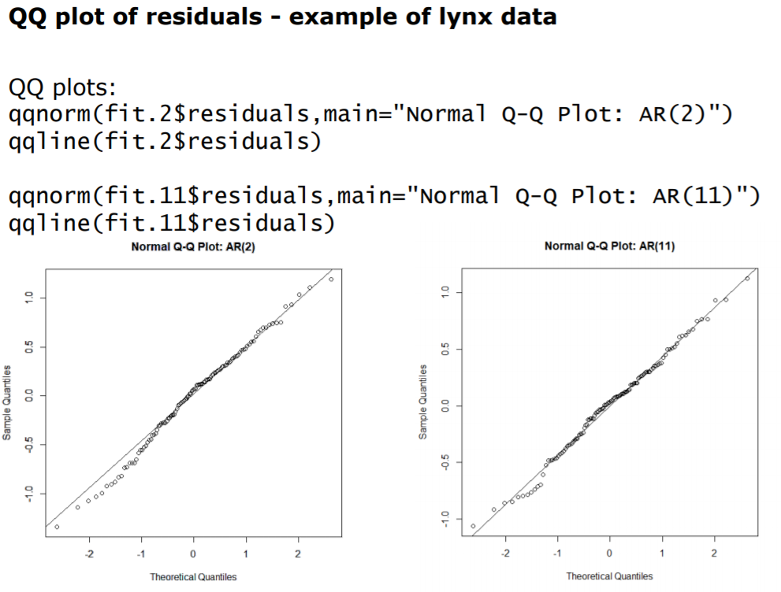
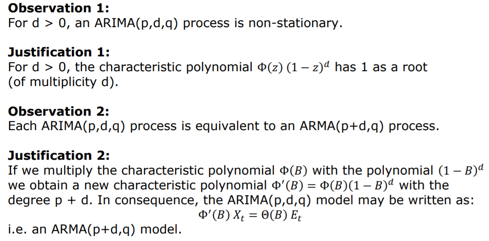

```{r setup, include=FALSE}
knitr::opts_chunk$set(echo = TRUE)
```

# Introduction

## Create Time Series
What is the expected period (time period of repetition) and the time step for the following timeseries:
```{r, eval=F}
dat = floor(runif(n= 1000, min = 1, max= 2000))
```

a) Sunshine duration per month in Basel from 1990 to 2000
```{r, eval =F}
ts(data = dat, start=c(1990,1),end=c(2000,12), frequency = 12)
```

b) Number of newborn babies in the city of Zurich per year from 2000 to 2011
```{r, eval =F}
ts(data=dat, start=2000,end=2011,frequency = 1)
```

c)Number of reservations in a restaurant for every night during 4 weeks
```{r, eval = F}
ts(data=dat, start=1,end=4,frequency = 7)
```

d) Water runoff of a river. The data has been collected every day for 4 years
```{r, eval = F}
ts(data=dat, start=1,end=4,frequency = 365)
```


## Simulate Time Series

```{r}
zeitsim <- read.table('https://stat.ethz.ch/Teaching/Datasets/WBL/zeitsim.dat')
zeitsim.ts <- ts(zeitsim[,1:4], start = 1, frequency = 1)
```

Simulate timeseries according to the following models:
```{r, eval =F}
set.seed(100)
Et <- ts(rnorm(101, 0, 1))
Et [1] <- 0
y1 <- 0

for (i in 2:length(Et)) {
  y1[i] <- Et[i]
  }

y1 <- y1[2:length(y1)]
ts.y1 <- ts(y1)
```

**a) Y1: Yt = Et − 0.5 · Et−1 , where Et ∼ N(0, 1) i.i.d. E0 = 0**

```{r, message=F, warning=F, error =F}
set.seed(100)
Et <- ts(rnorm(101,0,1))
Et [1] <- 0
y1 <- 0
for (i in 2:length(Et)) {
  y1 [i] <- Et[i] - 0.5 * Et[i-1]
}

y1 <- y1[2:length(y1)]
ts.y1 <- ts(y1)

par(mfrow= c(1,2))
plot(ts.y1, lwd = 1.5, main = 'Y1: Yt = Et − 0.5 · Et−1 , where Et ∼ N(0, 1) i.i.d. E0 = 0')
plot(zeitsim.ts[,1], main = 'Zeitsim Y1', lwd = 1.5)
```

Answer: 

- stationary time series

- MA(1) process


**b)Y2: Yt = Yt−1 + Et, where Et ∼ N(0, 1) i.i.d. Y0 = 0**

```{r}
set.seed(100)
Et <- ts(rnorm(100,0,1))
y2 <- 0
for (i in 2:length(Et)) {
  y2[i] <- y2[i-1] + Et[i]
}

ts.y2 <- ts(y2)

par(mfrow = c(1,2))
plot(ts.y2, main = 'Y2: Yt = Yt−1 + Et, where Et ∼ N(0, 1) i.i.d. Y0 = 0', lwd = 1.5)
plot(zeitsim.ts[,2], main = 'Zeitsim Y2', lwd = 1.5)
```

Answer:

- non stationary time series

- Yt-1 and Et are uncorrelated random variables


**c) Y3: Yt = 0.5 · Yt−1 + Et, where Et ∼ N(0, 1) i.i.d. Y0 = 0**

```{r}
set.seed(100)
Et <- ts(rnorm(100,0,1))
y3 <- 0
for (i in 2:length(Et)) {
  y3[i] <- 0.5 * y3[i - 1] + Et[i]
}

ts.y3 <- ts(y3)

par(mfrow = c(1,2))
plot(ts.y3, lwd = 1.5, main= 'Y3: Yt = 0.5 · Yt−1 + Et, where Et ∼ N(0, 1) i.i.d. Y0 = 0')
plot(zeitsim.ts[,3], main = 'Zeitsim Y3', lwd = 1.5)
```

Answer:

- stationary time series

- AR(1) process

**d) Y4: Yt = Yt−1 · Et, where Et ∼ U(0.95, 1.05) i.i.d. Y0 = 1**

```{r}
set.seed(100)
Et <- ts(runif(100,0.95, 1.05))
y4 <- 1
for (i in 2:length(Et)) {
  y4[i] <- y4[i-1] * Et[i]
}

ts.y4 <- ts(y4)

par(mfrow= c(1,2))
ts.plot(ts.y4, main ='Y4: Yt = Yt−1 · Et, where Et ∼ U(0.95, 1.05) i.i.d. Y0 = 1', lwd = 1.5)
plot(zeitsim.ts[,4], main = 'Zeitsim Y4', lwd = 1.5)
```

Answer:

- non stationary time series, as Var(Yt) is NOT constant


# Transformation

- Linear transformation (mostly for unit/range conversion)

- Log transformation (to reduce right-skewedness in data distribution)

## Stationarity

A stationary time series is one whose properties do not depend on the time at which the series is observed. Thus, time series with trends, or with seasonality, are not stationary — the trend and seasonality will affect the value of the time series at different times.
A white noise series is stationary — it does not matter when you observe it, it should look much the same at any point in time.

Some cases can be confusing — a time series with cyclic behaviour (but with no trend or seasonality) is stationary. This is because the cycles are not of a fixed length, so before we observe the series we cannot be sure where the peaks and troughs of the cycles will be.

In general, a stationary time series will have no predictable patterns in the long-term. Time plots will show the series to be roughly horizontal (although some cyclic behaviour is possible), with constant variance.

### Testing Stationarity

- Only the time series process can be tested for stationarity not the realization

- Augmented Dickey-Fuller test

- Phillips-Perron Test

- KPSS Test

- Elliot Rothenberg-Stock

- Schmidt-Phillips

- Zivot-Andrews


## Skewness

The direction of the skew is dependent on whether the bulk of the material is above the mean line (negative skew) or below the mean line (positive skew).
```{r, echo=FALSE, out.width = '50%'}
knitr::include_graphics("skewness.png")
```

## Linear Transformation

**Yt = mXt + b** with **m** and **b** as constants.
Used for conversion of units:

CHF to EURO
Km to meters
Joule to Kilowatt-hours

Linear transformations only scale key properties such as autocorrelations, models and forecasts.

## Log Transformation

**gt = log(Xt)**

Used for right-skewed time series distributation or if the data show variation that increases or decreases with the level of the series, then a transformation can be useful. Logarithms can help to stabilise the variance of a time series.
For example, if we denote the original observations as y1,…,yT and the transformed observations as w1,…,wT, then wt=log(yt).
Logarithms are interpretable: changes in a log value are relative (or percentage) changes on the original scale. So if log base 10 is used, then an increase of 1 on the log scale corresponds to a multiplication of 10 on the original scale. Another useful feature of log transformations is that they constrain the forecasts to stay positive on the original scale.

Example (log is the logarithm to the base 10), i.e. 
log(1) =  0
log(10) = 1
log(100) =2 
log(1000)=3
and so forth. 

This means that the logarithm squezes all values between 1 and 10 to the range between 0 and 1, all values between 10 and 100 to the range between 1 and 2, and all values between 100 and 1000 to the range between 2 and 3. In conclusion, the higher the values get, the more the logarithm squeezes them together.


## Box-Cox Transformation

```{r, echo = F, out.width='100%'}

```

R-code: BoxCox.lambda(data) 

# Methods for trend determination/elimination

- (linear) fitting, e.g. with ordinary least square fitting

```{r}

```

- (Backwards) differencing (higher order differences eliminate higher order polynomial trends)
- filtration

**Advantages and drawbacks of the individual procedures**

```{r, echo = F, out.width='100%'}

```

## Linear Regression 

Detrending with linear regression it is possible if the trend is deterministic (e.g. a linear trend). You run a linear regression to estimate the trend and remove it from the data.

```{r, echo = F, out.width= '100%'}

```

In deterministic models, the output of the model is fully determined by the parameter values and the initial conditions.

Stochastic models possess some inherent randomness. The same set of parameter values and initial
conditions will lead to an ensemble of different outputs.

If the trend is stochastic you should detrend the series by taking first differences on it.

## Differencing

One way to make a non-stationary time series stationary — compute the differences between consecutive observations. Computing the differences between consecutive observations, is known as differencing.

Differencing can help stabilise the mean of a time series by removing changes in the level of a time series, and therefore eliminating (or reducing) trend and seasonality.

```{r, echo = F, out.width= '100%'}

```

**Connection to calculus**

```{r, echo = F, out.width='100%'}

```


Summary:
+ trend and seasonal effect can be removed
+ procedure is very quick and very simple to implement

- trend, season and remainder component are NOT known, and cannot be visualised
- resulting time series will be shorter than original data set
- differencing creates artificial new dependencies that are different from the original ones
- extrapolation of trend, season and remainder is not easily possible


## Random Walk
```{r, echo=FALSE, out.width = '100%'}
knitr::include_graphics("random_walk.png")
```

## Second-order differencing

```{r, echo = F, out.width= '100%'}

```

```{r, echo=FALSE, out.width = '100%'}
knitr::include_graphics("diff_2.png")
```

```{r, echo = F, out.width= '100%'}

```


### Taylor's Theorem

```{r}

```


## Seasonal differencing

Seasonality manifests itself by a repetitive behaviour after a fixed lag time p.

**Yt = Xt - Xt-p = (1 - B^p)Xt**

Note: (1 - B^p) is NOT (1 - B)^p

```{r, echo=FALSE, out.width = '100%'}
knitr::include_graphics("deason_diff.png")
```

```{r, echo=FALSE, out.width = '100%'}
knitr::include_graphics("drug.png")
```

**Example of time series representation with seasonality**

```{r, echo = F, out.width='100%'}

```

**Example of time series representation with seasonality**

```{r, echo = F, out.width= '100%'}

```

**Calculation of the time series with seasonality**
```{r, echo = F, out.width= '100%'}

```


## Backshift operator and Backshift notation
```{r, echo = F, out.width= '100%'}

```

```{r, echo=F}

```

### Remove linear Trend of a non-stationary time series by taking differences of first order at lag 1: diff(x, differences = 1)

```{r, echo=F, out.width='50%'}
knitr::include_graphics('diff_trend.png')
```

The new time series Yt is going to be stationary, but has new, strong and artificial dependencies

- Yt now are the observation to observation changes in the series, NOT longer the observations or remainder itself
- does not yield estimates for trend, season and remainder component

### Differencing for log-transformed series: diff(log(x), differences = 1, lag = 1)

```{r, echo = F, out.width='50%'}
knitr::include_graphics('diff_log.png')
```


### Remove polynomial Trend: diff(x, differences = 2 or more)

```{r, echo = F, out.width= '50%'}
knitr::include_graphics('diff_higher.png')
```

This will remove a polynomial trend. A quadratic trend can be removed by taking second-order differences (differences = 2). 


Time series with seasonal effects can be made stationary through differencing by comparing to the previous periods’ value.

### Remove Seasonality: diff(x, lag = p)

```{r, echo=F, out.width='50%'}
knitr::include_graphics('diff_season.png')
```


To remove Trend and Seasonality take first order differences at the lag = p of the period, which removes both trend and season effects: diff(x, differences = 1, lag = 12) example: p = 12


## Filtration to reduce noise impact

Differencing and filtering is not the same!!

```{r, echo = F, out.width= '100%'}

```

Filtering is used to reduce the noise element, by averaging multiple (e.g. 3) measurements, short-term variations are smoothed out and the trend is confirmed -> We obtain a new averaged time series. 

```{r, echo = F, out.width= '25%'}

```


In case of seasonality effects, the has to expand over the full period to extract the trend and to quantify the seasonal impact, the values of the same time in the season have to be averaged.

```{r, echo = F, out.width='100%'}

```

### Additive linear filters

```{r, echo = F, out.width= '100%'}

```

**Example of filter aplication**

```{r, echo = F, out.width='100%'}

```

### Exponential smoothing filter


### Advantages and Drawbacks

Soomthing, filtering:

+ trend and seasonal effect can be estimated
+ trend, season and remainder are explicitly known & can be visualized 
+ procedure is transparent and simple to implement

- resulting time series will be shorter than the original
- the running mean is not the very best smoother
- extraolation of trend and season are not entirely obvious
- seasonal effect is handled as constant over time


## Decomposition

The aim of time series analysis is to reduce the series to stationarity.

### Basic Structures
The following two structures are considered for basic decomposition models:
Additive: Xt = Trend + Seasonal + Random
Multiplicative: Xt = Trend * Seasonal * Random

**How to Choose Between Additive and Multiplicative Decompositions**
- The additive model is useful when the seasonal variation is relatively constant over time.
- The multiplicative model is useful when the seasonal variation increases over time.

The additive decomposition is the most appropriate if the magnitude of the seasonal fluctuations, or the variation around the trend-cycle, does not vary with the level of the time series.

When the variation in the seasonal pattern, or the variation around the trend-cycle, appears to be proportional to the level of the time series, then a multiplicative decomposition is more appropriate. Multiplicative decompositions are common with economic time series.

An alternative to using a multiplicative decomposition is to first transform the data until the variation in the series appears to be stable over time, then use an additive decomposition. When a log transformation has been used, this is equivalent to using a multiplicative decomposition because:

```{r, echo=FALSE, out.width = '100%'}
knitr::include_graphics("components.png")
```


## Identify characteristics of Time Series

Have a look at the following set of time series. For every series, shortly answer the following questions
(motivate your answers):
• Is the time series stationary?
• Is there a trend?
• Can one find some seasonal effect? If yes, what is the period?
• Which transformation should be applied (if required)?
```{r, echo=FALSE,out.width = '100%'}
knitr::include_graphics("Ex1.3a.PNG")
```

Answer: 
- non stationary
- non linear trend, mostly increasing 
- no seasonal component
- log transformation

```{r, echo=FALSE,out.width = '100%'}
knitr::include_graphics("Ex1.3b.PNG")
```

Answer: 
- seems stationary
- trend from before was removed by diff(difference = 1)
- constant variance achieved by taking the logarithm. However Log-Returns are NOT stationary, because of volatility clusters

```{r, echo=FALSE,  out.width = '100%'}

```

Answer:
- non stationary
- exponential increasing trend
- seasonal component with period 1 year
- increasing variance, log transformation benefitial to get additive components

```{r, echo=FALSE, out.width = '100%'}
knitr::include_graphics("Ex1.3d.PNG")
```

Answer:
- non stationary
- increasing trend
- seasonal component with period 1 year and increasing variance
- increasing variance, log transformation benefitial to get additibe components

```{r, echo=FALSE,  out.width = '100%'}
knitr::include_graphics("Ex1.3e.PNG")
```

Answer:
- non stationary
- no visible trend
- seasonal effect with period 1 year

Yeary numbers of sunspots:
```{r, echo=FALSE, out.width = '100%'}
knitr::include_graphics("Ex1.3f.PNG")
```

Answer:
- likely to be stationary
- no trend
- no seasonal effect
- periodicity with period of 11 years
- variance maybe different over time
- log transformation required due to right skewness

```{r, echo=FALSE, out.width = '100%'}

```

Answer:
- probably stationary
- no clear trend visible
- no seasonal effect visible
- no transformation required


# Quantitative Description and Correlation functions

Autocorrelation measures the linear relationship between lagged values of a time series and quantifies dependencies.
There are several autocorrelation coefficients, corresponding to each panel in the lag plot. For example,  
r1 measures the relationship between yt and yt−1, r2 measures the relationship between yt and yt−2, and so on.

```{r, echo = F, out.width='50%'}

```

## What is important about ACF estimation?

- Correlations are never to be trusted without a visual inspection with a scatterplot.
- The bigger the lag k, the fewer data pairs remain for estimating the acf at lag k.
- Rule of the thumb: the acf is only meaningful up to about
a) lag 10*log10(n)
b) lag n/4
- The estimated sample ACs can be highly correlated.
**- The correlogram is only meaningful for stationary series!!!**


## Lagged Scatterplots

With lagged scatterplots correlations of consecutive observations are possible. Original time series values will be plotted against a time-shifted version. e.g. xi, xi-k. 
The average over a realization will be exchanged with the average over time.
We assume that for stationary time series, the correlation depends only on the lag.

```{r, echo =F, out.width='100%'}

```

Observations:

The plot with lag 1 shows a inear pattern, which indicates a correlation between subsequent data points. A ag 10 however results in a rather unspecific scatter plot.

Formula:

```{r, echo = F, out.width='100%'}

```

Outliers may be diagnosed by lagged scatter plots. Note that each outlier causes other outliers. 

Strategies for coping with outliers:
a) Delete the point or replace it with Na (most functions in R can handle this)

Replace the outlier value with
b) global mean of the series
c) nearest value in the vicinity
d) local mean of the series (i.e. odd number of surrounding values)
e) fit a time series model to the remaining/surrounding values and predict the missing value


## Plug-in Estimator

Plug-in estimation is the standard approach for computing autocorrelations in time series analysis. It is better than the lagged scatterplot idea, however the plug-in estimator p(k) is sensitive to outliers.

**Calculated with the acf() function in R.**

```{r, echo = F, out.width='100%'}

```


**Formula**

```{r, echo = F, out.width='100%'}

```

### Lagged scatterplot estimator versus Plug-in estimator for autocorrelation

```{r, echo = F, out.width='100%'}

```


## Autocorrelation ACF

The ACF plot is also useful for identifying non-stationary time series. For a stationary time series, the ACF will drop to zero relatively quickly, while the ACF of non-stationary data decreases slowly. Also, for non-stationary data, the value of r1 is often large and positive.

- For time series shorter than 100 elements, the plug-in estimator p(k) is biased

```{r, echo = F, out.width='100%'}

```

Concept:
The correlation p(k)^2 squared corresponds to the percentage of variability explained by the linear association between Xt and Xt+k -> R^2.

**Variance: Var(Xt) = E[(Xt-mean)^2] = Cov(Xt,Xt) with mean = E[Xt]**

### ACF Characteristics 

```{r, echo = F, out.width='100%'}

```

### Patterns in ACF of non-stationary time series

```{r, echo = F, out.width='100%'}

```

### Trend in ACF plots

When data have a trend, the autocorrelations for small lags tend to be large and positive because observations nearby in time are also nearby in size. So the ACF of trended time series tend to have positive values that slowly decrease as the lags increase. 

### Season in ACF plots

When data are seasonal, the autocorrelations will be larger for the seasonal lags (at multiples of the seasonal frequency) than for other lags.

When data are both trended and seasonal, you see a combination of these effects. 


## Partial Autocorrelation PACF

The ACF measures the „simple“ dependence between and , whereas the PACF measures that dependence in a „multiple“ fashion.
Given a time series , the partial autocorrelation of lag , is the autocorrelation between and with the linear
dependence of through to removed.
It is a conditional correlation of the random variables A, B under condition C.

## Ljung-Box Test

The Ljung-Box approach tests the Null-Hypothesis that a number of autocorrelation coefficients are simultaneously equal to 0. Meaning, the Ljung-Box test tests for significant autocorrelation in a time series.

The Ljung–Box test may be defined as:

H0: The data are independently distributed (p-value > 0.05)

Ha: The data are not independently distributed; they exhibit serial correlation. (p-value < 0.05)

Formula and R-code:

```{r, echo = F, out.width='100%'}

```

Outcome:

The p-value shows that the series is not independently distributed. H0 rejected. Ha accepted.


## White Noise

Time series that show no autocorrelation are called white noise.
For white noise series, we expect each autocorrelation to be close to zero. Of course, they will not be exactly equal to zero as there is some random variation.
For a white noise series, we expect 95% of the spikes in the ACF to lie within ±2/√T where T is the length of the time series.
It is common to plot these bounds on a graph of the ACF. If one or more large spikes are outside these bounds, or if substantially more than 5% of spikes are outside these bounds, then the series is probably not white noise.

## STL Decomposition

The Seasonal-Trend Decomposition Procedure by Loess
• is an iterative, non-parametric smoothing algorithm
• yields a simultaneous estimation of trend and seasonal effect
-> robust!
+ very simple to apply
+ very illustrative and quick
+ seasonal effect can be constant or smoothly varying
- model free, extrapolation and forecasting is difficult

-> Good method for „having a quick look at the data“


# Linear Modeling with AR, MA and ARMA 

Exponential smoothing and ARIMA models are the two most widely used approaches to time series forecasting, and provide complementary approaches to the problem. While exponential smoothing models are based on a description of the trend and seasonality in the data, ARIMA models aim to describe the autocorrelations in the data.

Steps: 
- remove trend
- remove seasonality
- fit residuals


Purpose of modelling:
- to explain hidden structures
- to predict future values

Challenge:
- What model is the most suitable model?

```{r, echo=F, out.width= '100%'}

```

## ARIMA models: Overview

```{r, echo =F, out.width='50%'}
knitr::include_graphics('over.png')
```

```{r, echo =F, out.width='100%'}

```
## Simulating data

### Simulating an AR(p) model

R-code: arima.sim(n=1000, list(ar=c(alpha1, alpha2,...,alpha(p))))

### Simulating a MA(q) model

R-code: arima.sim(n = 1000, list(ma=c(beta1, beta2,...,beta(q))))

### Simulating an ARMA(p,q) model

R-code: arima.sim(n = 1000, list(ar=c(alpha1, alpha2,...,alpha(p)),ma=c(beta1, beta2,...,beta(q))))

### Theoretical autocorrelation function

R-code: ARMAacf(ar=c(alpha1,alpha2,...,alpha(p)), pacf=TRUE)
R-code: ARNAacf(ma=c(beta1,beta2,...,beta(q)), pacf= TRUE)


## Characteristic polynomial

```{r, echo = F, out.width= '75%'}

```


## AR(p) - Autoregressive Models

AR Models are exclusively used for the modeling of STATIONARY processes and base on the idea that the current value of the series can be explained by a linear combination of the p previous values **Xt-p + et (et = innovation = 'completely independent term'). Meaning, we forecast the variable of interest using a linear combination of past values of the variable. The term autoregression indicates that it is a regression of the variable against itself.

```{r, echo = F, out.width= '50%'}

```

For a AR(1) process its definition it's:

```{r, echo=F, out.width='25%'}

```

That means that the random walk is a special case of an AR(1) with a1 = 1.


An AR(p) stochastic process is weakly stationary, if all complex roots of the characteristic polynomial exceed 1 in absolute value. 

R-Code: polyroot() function -> computes the complex roots of a given polynomial.

Changing the parameters ϕ1,…,ϕp results in different time series patterns.

```{r, echo = F, out.width= '50%'}

```

### Fitting AR(p)-Models 

**1) Model identification and order identification**
- is an AR process suitable, and what is the p?
- will be based on ACF/PACF-Analysis (ACF fast decaying/PACF cut-off at p)
- order identification (cut-off of PACF)

```{r, echo = F, out.width='100%'}

```


**2) Parameter Estimation and Fitting**
- Regression approach with OLS
- Yule-Walker-Equations
- MLE
- Burg-Algorithm

**3) Model Diagnostic -> Residual Analysis**
- Time Series plot of Êt (Êt = Residuals)
- ACF/PACF plot of Êt (Êt = Residuals)
- QQ-plot of Êt (Êt = Residuals)
->>> the innovation time series Êt should look like White Noise
- simulation of time series and qualitative comparison

###1) Autocorrelation of AR(p) processes

Autocorrelation function is used to clarify if the AR(p) model is the right choice and what is the proper order p for the given data, but it will turn out that the ACF is not sufficient, while we need to use the **partial autocorrelation**.


##2) Parameter identification

The following methods are equal for theoretical models and yield similar results on realizations.
The models are sensitive to outliers and work best on data that follows a normal (gaussian) distribution.


### OLS - Ordinary Least Square 

Procedure:
1) estimate the global mean and determine xt = yt - m
2) carry out regression on xt without intercept; resulting parameters are a1, a2, ... , a(p)
3) estimate the standard deviation (sd) of the innovation from the standard deviation of the residual

R-code: ar.ols(data, order = p)


### Yule Walker Equations

These equations are used for fitting an AR(p)-model:

1) estimate the ACF from a time series
2) plug-in the estimates into the Yule-Walker-Equations
3) the solution are the AR(p)-coefficients

Note: the model coefficients and the ACF values are interlaced

R-code: ar.yw(data, order = p)

### Burg' Equation's Algorithm

Another fitting cost function that exploit (erschliessen) the first p function values. 

R-code: ar.burg(data, order.max=p)

### MLE - Maximum Likelihood Estimator

Determines the parameter based on an optimization of the maximum likelihood function. This requires the choice of a probability model for the time series.

R-code: arima(data, order=c(2,0,0))


->>>> All estimation methods mentioned above yield similar results.

**How to choose the optimum model order p?**

### AIC - Akaike Information Criterion

Estimates the relative amount of information list by the considered model. Based on the idea, that less information a model loses, the higher the quality of that model. 

### BIC - Bayesian Information Criterion 

Similar to AIC. Will be used for evaluating model fit and choosen parameters. Same as the AIC the BIC will be used in the auto.arima() function for automated order/model fit.


##3) Model Diagnostic 

### Residual Analysis to check whether the model fit is appropriate

Checkresiduals() function in R provides a graphical and text output. We get a plot of the residuals, their ACF correlogram and the histogram of the residuals.

How to test:
- Visually by plotting

```{r, echo = F, out.width='100%'}

```

- ACF/PACF of the new time series

```{r, echo = F, out.width='100%'}

```

- QQ plot of the new time series

```{r´, echo = F, out.width='100%'}

```

- Simulating the time series models and qualitative comparisons

```{r, echo = F}

```


## MA(q)

MA models are an extension of the White Noise process. The process is stationary but not iid. It's a linear combination of the current innovation term Et, plus the q most recent ones Et-1,...,Et-q

- are (weakly) stationary
- **clear cut-off in the ACF** ->  p(k) = 0 for all k larger than q
- **PACF dislays a fast decaying** or a damped sinusoid behaviour
- the order q is derived by the lag where the autocorrelation function has a cut-off.

```{r, echo = F, out.width= '50%'}

```

A MA model does not have an explicit reference to previous values; only the innovation parts are considered.

```{r, echo = F, out.width= '50%'}

```

```{r, echo = F, out.width= '50%'}

```


### Invertibility

Invertability of an MA model means that you can reformulate it as an AR(infinity) model. This is a property specific to MA models, because AR(p) models are automatically AR(infinity) models. 

The benefit of being invertible for an MA model is that you can reformulate this model as being exclusively dependent on the past.

**Why is this the case?**

An AR model expresses the next time step as a superposition of the previous steps. Therefore, only your past and a bit of noise (innovation) influences your future. 

If we consider a non-invertible MA model, such as  Xt=Et−2Et−1. Then we can rewrite this into: Et=Xt+2Et−1 

Evaluating the **Et=Xt+2Et−1** equation at time  t−1  we obtain: 

**Et−1=Xt−1+2Et−2** 

Inserting this in the equation **Xt=Et−2Et−1**, we get: 
Xt=Et−2(Xt−1+2Et−2)=−2Xt−1+Et−4Et−2=−2Xt−1+Et−4(Xt−2+2Et−3)… 

This equation does not converge (annähern), because |θ1| > 1. Therefore, more information than just the past steps is required.

Just as we can define an infinite-order moving average process, we can also define an infinite-order autoregressive process, AR(∞). It turns out that any stationary MA(q) process can be expressed as an AR(∞) process. E.g. suppose we have an MA(1) process with μ = 0.

It turns out that if |θ1| < 1 then this infinite series converges to a finite value. Such MA(q) processes are called invertible.

Property 1: If |θ1| < 1 then the MA(1) process is invertible

Property 2: If |θ2| < 1 and |θ1| + θ2 < 1 then the MA(2) process is invertible

• An MA(1)-, or in general an MA(q)-process is said to be invertible if the roots of the characteristic polynomial lie outside of the unit circle.

• Under this condition, there exists only one MA(q)-process for any given ACF. But please note that any MA(q) is stationary, no matter if it is invertible or not.

• The condition on the characteristic polynomial translates to restrictions on the coefficients. For any MA(1)-model, is required.

R-code: polyroot() ->> for finding the roots


### Fitting MA(q)-Models 

**1) Model identification and order identification**
- MA(q) models are (weakly) stationary
- ACF: clear cut-off -> p(k) = 0 for all k larger than q
- PACF: fast decaying or damped sinusoid behaviour
- order identification (cut-off of ACF)

```{r, echo = F, out.width='100%'}

```


**2) Parameter Estimation and Fitting**
- Yule-Walker-Equations
  R-code: ma.yw(data, order = q)

- MLE - Maximum-Likelihood Estimation (Default method in R)
  R-code: arima(data, order=c(...), method='CSS-ML')
  
- Conditional Sum of Squares
  R-code: arima(data, order=c(...), method='CSS')
  
  MA(1) = order= c(0,0,1)
  MA(2) = order= c(0,0,2)

**3) Model Diagnostic -> Residual Analysis**
- plot of the residuals for (Êt) the fit
- QQ plot of Êt (residuals)
- ACF/PACF plot of the residuals (Êt) from the fit
  R-code: tsdisplay(fit$residuals)
->>> the residuals should look like White Noise
- simulation of time series and qualitative comparison


## ARMA (p,q)

AR and MA together gives the following formula:

```{r, echo = F, out.width='25%'}

```
```{r, echo = F, out.width='50%'}

```

ARMA models are used if ACF and PACF have NO clear cut-off.
We assume that Et is causal and White Noise.


### Fitting ARMA(p,q)-Models 

**1) Model identification and order identification**
- model need to be stationary
- ACF and PACF: drop at (p/q), no clear cut-off

```{r, echo = F, out.width='100%'}

```

- order identification for p and q
->>>> trial and error method!!! Typical range: p + q <= 5


**2) Parameter Estimation and Fitting**
  
- Conditional Sum of Squares for any invertible ARMA(p,q) process
  R-code: arima(data, order=c(...), method='CSS')
  
  ARMA(1,1) = order= c(1,0,1)
  ARMA(2,1) = order= c(2,0,1)
  ...
  
- MLE - Maximum-Likelihood Estimation (Default method in R) for ARMA after CSS-process
  R-code: arima(data, order=c(...), method='CSS-ML')
  
  
**FITTING**
R-code:
fit <- auto.arima(data,max.p=10, max.q = 10, stationary = TRUE, seasonal = FALSE, ic = 'aic', stepwise = FALSE)

https://www.rdocumentation.org/packages/forecast/versions/8.10/topics/auto.arima


max.p = 10//max.q = 10 --> anzahl lags bzw. bis zu welchem bereich man maximal untersuchen möchte
ic = information criterion wird normal auf 'aic' gesetzt

```{r, echo = F, out.width='100%'}

```

---> intercept: ist die empfohlene Mittelwertsverschiebung und wird der Gleichung mit + m hinzugefügt

**How to find the best model?**

----> compare different models with AIC and visually inspect the fitting quality

**3) Model Diagnostic -> Residual Analysis**
- plot of the residuals for (Êt) the fit
- QQ plot of Êt (residuals)
- ACF/PACF plot of the residuals (Êt) from the fit
  R-code: tsdisplay(fit$residuals)
->>> the residuals should look like White Noise
- simulation of time series and qualitative comparison
R-code: tsdisplay(resid(fit))


# Linear Regression with Time Series

Linear Regressions are used for modeling time series depending on external variables (other time series). One of the major challenges is, that often in real world data, the errors may be strongly correlated. Thatswhy an conventional fit with OLS is not possible. Only is the independent variables seem to be uncorrelated we can use the model. 

```{r,echo = F, out.width='25%'}

```
Yt = abhängige Variable (Oxidant)
beta0 = offset
beta1 = linearer beitrag variable 1 (wind)
beta2 = linearer beitrag variable 2 (temperatur)
Et = Fehler (hier sammelt sich alles was NICHT gefittet werden konnte)

**IMPORTANT** 
The Et term in this model stands for an ERROR-TERM not an innocation as in AR,MA or ARMA models!!!

- check if independent variables are independent from each other (with plot)
- check if time series is stationary
- check if errors (Et) are independent and check the ACF/PACF structure with plot(resid(fit.lm))
--->>>>> whenever the error terms are dependent,the error estimation of the linear regression is not valid (error statistics from summary(lm) not usable)
- dependent variable (Yt) should not have an effect on the independent variables (xt1, xt2 = wind, temperature)


## Durbin-Watson Test

The test assesses the autocorrelation in the residuals by calculation the test statistics

```{r, echo=F, out.width='50%'}

```
Important: the test won't check any correlation level, so an additional check with ACF and PACF is neccessary.

R-code:
library(lmtest)
dwtest()

The test could be dangerous because it is possbile that is does not show an existing correlation


## Cochrane-Orcutt Method

The method is valid for correlated error terms of AR(1) models only. 

Precondition: Residuals after linear regression display an AR(1) behavior

Steps:
1. Perform OLS - ordinary least square fit on data with:
mod.ols <- lm(y ~ x1 + x2 + x3 + ..., data = data)

2. Analyse (P)ACF and fit AR(1) model on residuals and check if it shows a AR(1) structure -> PACF with cut-off at lag 1 and ACF with damped sinus or fast decay.

3. Transform data according to parameter of the residuals’ AR(1) process. use new alpha from AR(1) process and fit: 
Yt' = Yt - (alpha) * Yt-1

4. Fit the transformed data to determine the parameters of the linear model.

res.fit <- arima(residuals(mod.ols, order = C(2,0,0)))


## GLS - Generalized Least Square Method

The method is valid for correlated error terms of different AR(p) models. 
Solve for coefficients of linear fitting model (beta) and for the error model (alpha) at the same time based on the optimization of a maximum likelihood function.

1.) define a MLE function and optimize with fitting parameter (beta - beta 1 = wind, beta = temperature)

R-code:
library(nlme)
mod.gls <- gls(y ~ x1 + x2 + x3, data = data, correlation = corARMA(p = 2), method = 'ML')
summary(mod.gls)

### Summary of fitting results for OLS and GLS

```{r, echo = F, out.width='100%'}

```

# Modeling of ARIMA and SARIMA models 

## ARIMA

ARIMA models are non-stationary ARMA models with a Trend, which will be removed by differencing with the (I = Integration) and aim to describe the autocorrelations in the data. 

```{r, echo = F, out.width='50%'}

```

R-code: fit <- arima(data, order = c(1,1,1))

## Fitting an ARIMA model

fit <- arima(log(data) oder data, order = c(p,d,q)) p,d,q = tell order identified from ACF/PACF and plot
or
fit <- arima(diff(log(data)) or diff(data), order = c(p,0,q), include.mean = F)  Note d= 0 due to the diff() 

Output:
```{r, echo = F, out.width = '100%'}

```

Equation fitting from R output:
```{r, echo = F, out.width= '100%'}

```


### Stationarity and equivalence to ARMA(p+1,q) process

```{r, echo = F, out.width='100%'}

```


### Special cases of ARIMA models
```{r, echo = F, out.width= '50%'}

```


## SARIMA

SARIMA models are non-stationary ARMA models with a Trend and Seasonal component, which will be removed by differencing with the (I = Integration) and aim to describe the autocorrelations in the data.

```{r, echo = F, out.width= '50%'}

```

```{r, echo = F, out.width='50%'}

```


```{r, echo = F, out.width= '50%'}

```

Output of sarima with manually fitted order:
```{r, echo = F, out.width= '100%'}

```

Output of sarima with auto.arima():
```{r, echo = F, out.width='100%'}

```

**Steps:**
1. Estimate the seasonality period s visually. The order of differentiation D (for the seasonality part) is typically less or equal to 1.

2. Check if another differentiation of lag 1 is required for stationarity. If yes, try d=1, else d=0.

3. Analyse (P)ACF of the result Zt of the two differentiations. Determine p,q from the short-lag behavior and P,Q from the multiple-of-the-period dependency.

4. Fit the model with arima(data,order=c(p,d,q),seasonal=c(P,D,Q))

5. Check the applicability of the model by analyzing the residuals.(residuals should behave like (Gaussian) white noise)
 

## ETS vs ARIMA

```{r, echo = F, out.width= '50%'}

```

# Non-Linear Modeling for time series with changing variability

- Position of free-falling objects Xt = x0 - 1/2 g t^2
- Data with cyclic behavior and quicker increase than decrease
- Data with changing standard deviation (Heteroskedascity)

---> Heteroskedascity 
is data with a changing standard deviation and therefore non stationary, because the variance is changing over time

## ARCH/GARCH Models

AR Autoregressive
C conditional
H heteroskedastic
of the order p (abbreviated ARCH(p)) if it has the form:

```{r, echo = F, out.width='50%'}

```

Xt = standard deviation (for t) * white noise (for t)

As an ARCH(p) is an AR(p) process of Xt^2 (squared Xt) the order p is identified by:
- ACF decays exponentially
- PACF has a cut-off at p

Die quadrierten Werte im ACF sollen exponentiell schnell zerfallen und die PACF einen Cut-off bei p haben

```{r, echo = F, out.width='100%'}

```
```{r, echo = F, out.width='100%'}

```


### How to identify the fitting coefficients?

**Step 1:**

R-code:
library(tseries)
fit<-garch(data, order=c(q,p)) -> **note, first q then p**
```{r, echo = F, out.width='50%'}

```

a0 = off set (alpha0 parameter)
a1 = alpha1 parameter
a2 = alpha2 parameter 


**Step 2:**

plot data and fit residuals
R-code:
plot(data)
fit$fitted.values
plot(fit$fitted.values[,0:1])
```{r, echo = F, out.width='100%'}

```


**Step 3:**

Calculate ACF and PACF of SQUARED residuals
R-code:
values<-fit$residuals
acf(values^2,na.action=na.pass)
pacf(values^2,na.action=na.pass))

```{r, echo = F, out.width='100%'}

```

---->>>>> if residuals does not show any structure the model seems to fit well!!!!


# Forecasting

The concept of forecasting is to predict future values and estimate the range of uncertainty (usually 95%
prediction interval) based on past observations :

```{r, echo = F, out.width = '100%'}
knitr::include_graphics('fore.png')
```

Please be aware, that an extrapolation could be wrong and is based on uncertainties:

1. Is the model of the past data also appropriate for the future?(e.g. change of behavior, policy)
2. Did you choose the order of the ARMA(p,q) correctly?
3. Are the fitting parameters in the model (sufficiently) accurate?
4. How can you assess the contribution/variability of the innovation terms Et?
-> Therefore, we must restrict ourselves to short-term forecasting.

## Predict values for AR(p) models

How to predict values of stationary models?
```{r, echo = F, out.width='100%'}

```

Use window of data to check prediction. Code example
```{r, echo = F, out.width='100%'}

```

Predictions for higher AR(p) models use more past values to predict the future value and could result in better predictions. 

### Summary for forcasting AR(p) processes

- Only the last p observations are required for the forecast and the prognosis interval.
- The prognosis intervals only consider the uncertainty of the innovation. Other sources are neglected.
--->>>> In general, the uncertainties are underestimated
- As a check: Truncate the time series and test the fitting data on the remaining data. The accuracy of the prediction of the actual measurement values may give you a hint about its accuracy.

## Predict values for  MA(q) models and ARMA(p,q) models

```{r, echo =F, out.width='100%'}

```

```{r, echo =F, out.width='100%'}

```


## Predict values for  SARIMA(p,d,q) models

Features:

- The predicted values capture the trend and seasonality (cf. following example)
- The prediction intervals will typically increase over time.
- The prediction quality of the trend is not ascertained and may be poor.

```{r, echo = F, out.width = '100%'}

```

Result:
```{r, echo = F, out.width = '100%'}

```


## Forecasting decomposed models

**Decomposition workflow:**

1. Remove trend
2. Remove seasonality effects
3. Fit the remainder with an ARMA(p,q) model

```{r, echo = F, out.width='100%'}

```

**How to use this decomposition for a forecast?**

1. Trend: Extrapolate linearly or manually
```{r, echo = F, out.width='100%'}

```

2. Seasonal pattern: Copy previous values or extrapolate
```{r, echo = F, out.width='100%'}

```

3. Stationary remainder: Use forecast functions.
```{r, echo = F, out.width='100%'}

```

4. Adding the 3 components of the forecasts above
```{r, echo = F, out.width='100%'}

```


# Panel Data 

Panel data is a set of n observations mit mindestens 2 Beobachtungen pro Zeiteinheit.

Balanced data: in all columns is data
Unbalanced: not in all columns is data 

## Ordinary regression

It is used to find the impact of individual factors of a panel data set.

R-code: lm(y ~ x, data = data)

## Fixed effect models

These models are neccessary if a ordinary regression depends on the entity and therefor perhaps calculate a wrong regression.

A global least squares fit may yield wrong models for data with a constant
offset between two entities.

```{r, echo = F, out.width='100%'}

```

## Integrate bias ino regression

Assumtion: linear dependency between two “columns” of a panel data set and a entity dependent (𝑖 is the index of the entity, 𝑡 the index of time)

```{r, echo = F, out.width='100%'}

```

Solution: fit this model to the data
```{r, echo = F, out.width='100%'}

```

```{r, echo = F, out.width='100%'}

```

R-code:
```{r, echo = F, out.width='100%'}

```

```{r, echo = F, out.width='100%'}

```

lm(y ~x1 + x2 + x3(time component) -1, data = data) der

# Discrete Response

Binary or integer observations with potentially non-norml error distributions, which are not constant over time and with a very limited range of observables.

## Linear Probability Model

For binary response predicted as probabilities. The prediction of the regression will be interpret as the probability of a positive answer.

Fit and probability interpretation:

```{r, echo = F, out.width = '100%'}

```


# Estimate a simple linear probability model
linearProbModel <- lm(deny ~ pirat, data = HMDA)
```{r, echo = F, out.width = '100%'}

```


```{r, echo = F, out.width = '100%'}

```

We will interpret the coefficient as additional probability, as we see that the probability of denial will increase of 17.7% for afroamericans.

However this result seems to be not correct, therefor we will use the linear regression and try to fit a probit regression model for getting better results:


## Probit Regression

The linear regression predict the quantiles of the error distribution.

```{r, echo = F, out.width = '100%'}

```

Estimation:
```{r, echo = F, out.width = '100%'}

```

Due to the non-linearity of the impact of each variable the values are not in- or decreasing linearily. We will predict the probability for two different values X and (DELTA)X and compute the difference.

R-code:
# 1. Compute the predictions for P/I ratio = 0.3, 0.4
predictions <- predict(probitModel,
newdata = data.frame("pirat" = c(0.3, 0.4)),
type = "response“)

# 2. Compute the difference in probabilities.
diff(predictions)
Answer: 0.06081433

→ For payment/income ratio between 0.3 and 0.4, the probability of having the mortgage
denied increases by 6.1%.


# Visualize the probit model
```{r, echo = F, out.width='100%'}

```


```{r, echo = F, out.width = '100%'}

```

**ATTENTION:** The interpretation here is not the same as in the probability model. We have to compute the difference. see code below:

# 1. Compute the predictions for P/I ratio = 0.3
predictions <- predict(probitModelEthn,
newdata = data.frame("a" = c("no", "yes"),
"pirat" = c(0.3, 0.3)),
type = "response")

# 2. Compute the difference in probabilities
diff(predictions)
Answer: 0.1578

→ For a payment/income ratio of 0.3, the probability of having the mortgage
denied increases by 15.8 % if the applicant is Afro-American.


## Logit Regression

This regression is quite similar to the probit regression with the difference that we now use the cumulative logistically distribution with random variables.
```{r, echo = F, out.width = '100%'}

```

### Comparing the probit and the logit models

```{r, echo = F, out.width='100%'}

```

Coefficients are per se not comparable, but we can plot both regression lines and compare

```{r, echo = F, out.width='100%'}
knitr::include_graphics('visi.png')
```

```{r, echo = F, out.width='100%'}

```

# 1. Compute the predictions for P/I ratio = 0.3
predictions <- predict(logitModelEthn,
newdata = data.frame(“afam" = c("no", "yes"),
"pirat" = c(0.3, 0.3)),
type = "response")

# 2. Compute the difference in probabilities
diff(predictions)
Answer: 0.1493

→ For a payment/income ratio of 0.3, the probability having the mortgage
denied increases by 14.9% if the applicant is Afro-American (for the probit
model it was 15.8%).


**CONCLUSION** Probit and logit regressions return more or less the same results.


# Data sets and Exercises

## Hstart Data Set

Using the data hstart.dat, we illustrate various methods for descriptive decomposition and elimination of trends. The data contains monthly data on the start of residential construction in the USA within the time frame of January 1966 to December 1974. The data have undergone some transformation unknown to us (perhaps an index over some baseline value has been calculated, or perhaps the data are to be read as x · 10^? construction permits).

```{r}
hstart <- read.table('https://stat.ethz.ch/Teaching/Datasets/WBL/hstart.dat')
hstart.ts <- ts(hstart[,1], start = c(1966,1), end = c(1974,12), frequency = 12)
```

Make a time series plot. Is this a stationary time series? If not, what kind of nonstationarity is evident?
```{r}
plot(hstart.ts, lwd = 2, main = 'Residential construction in the USA')
```

- not stationary
- trend
- seasonal component
- decomposition possible into trend, seasonal effect and remainder:

```{r, echo=FALSE, out.width= '30%'}

```

b) Differences
Try to remove the trend and seasonal effects by computing differences. After removing seasonal effects, choose some linear trend elimination method from the course notes and plot the outcome.

**R hint:**
H.y <- diff(hstart, lag=12) # time series differences Yt = Xt − Xt−k, lag = k
H.z <- diff(H.y, lag=...)
par(mfrow=c(2,1))
plot(H.y)
plot(H.z)

```{r, echo=FALSE, out.width = '70%'}
knitr::include_graphics("diff.PNG")
```

- Remove seasonal effects by differencing with lag = 12
```{r, echo=FALSE, out.width = '30%'}
knitr::include_graphics("Ex1.2b1.PNG")
```

```{r}
hstart.season.diff <- diff(hstart.ts, lag = 12)
```

```{r, echo =F}
plot(hstart.season.diff, main = "Time series plot after removing the seasonal effect", lwd = 2)
```

```{r}
hstart.trend.diff <- diff(hstart.season.diff, differences = 1)
```

```{r}
plot(hstart.trend.diff, main = "Time series plot after removing the seasonal effect and the trend", lwd = 2)
```

Code in 2 steps as mentioned above in one code line:

```{r}
h <- diff(diff(hstart.ts, lag = 12))
plot(h)
```

```{r, echo=FALSE, out.width = '50%'}

```


### Modelling using a parametric model
Decompose the time series into the components using a parametric model. 

```{r, echo=FALSE, out.width = '30%'}
knitr::include_graphics("additive.png")
```

Plot the time series, including fitted values, and comment on any differences. Choose the order of the
polynomial according to how good it fits the real data. Compare the orders 3, 4 and 6.

```{r, echo=F, out.width='50%'}
knitr::include_graphics('parametric.png')
```

```{r}
Time <- 1:length(hstart.ts)
Time2 <- Time/12+1966
Months <- factor(rep(month.name, length(hstart.ts)/12), levels=month.name)
H.lm6 <- lm(hstart.ts ~ Months + Time + I(Time^2) + I(Time^3)+ I(Time^4) + I(Time^5) + I(Time^6))
H.lm3 <- lm(hstart.ts ~ Months + Time + I(Time^2) + I(Time^3))
H.lm4 <- lm(hstart.ts ~ Months + Time + I(Time^2) + I(Time^3)+I(Time^4))
H.fit6 <- ts(fitted(H.lm6), start=1966, freq=12)
H.fit3 <- ts(fitted(H.lm3), start=1966, freq=12)
H.fit4 <- ts(fitted(H.lm4), start=1966, freq=12)
```

```{r}
plot(hstart.ts, lwd = 2)
lines(H.fit6, col = 'red', lty = 2)
lines(H.fit3, col = 'purple', lty = 2)
lines(H.fit4, col = 'green', lty = 2)
```


**c)  STL decomposition**
Decompose the time series in trend, seasonal component and remainder using the non-parametric STL method, and add data from this decomposition to the plot from part a).

**R hint:**
The decomposition is made using **H.stl <- stl(hstart, s.window="periodic")**

Note: The smoothing parameter for the seasonal effect is chosen by means of s.window.
- If s.window="periodic", the seasonal effect is estimated by averaging.
- It is also possible to specify a value for the smoothing parameter (an odd number). Try e.g. H.stl.var <- stl(hstart, s.window = 15), and compare the result of this to H.stl. Incidentally, summary() can be used for displaying the values of window.

The trend estimation parameter can be set using t.window. Unlike s.window, this argument does have a default value (cf. the help file). Perhaps you could try to vary this parameter as well.
The documentation for R and the help files give more details.
Trend, seasonal component and remainder of the STL are stored in
H.st$time.series[,"trend"]
H.st$time.series[,"seasonal"]
H.st$time.series[,"remainder"]


### Decomposition of the time series with averaging a smoothing parameter:

```{r}
hstart.stl <- stl(hstart.ts, s.window = 'periodic')
summary(hstart.stl)
str(hstart.stl)
```

```{r}
plot(hstart.stl, main = "STL with s.window= 'periodic'", lwd = 2)
```

In the plot, we have the original data, additive seasonal effects, the trend curve and the
residuals (remainder) of the STL decomposition, drawn in order from top to bottom.


### Decomposition of the time series by manually choosing a smoothing parameter:

```{r}
hstart.stl.var <- stl(hstart.ts, s.window = 15)
summary(hstart.stl.var)
str(hstart.stl.var)
```

```{r}
plot(hstart.stl.var, main = 'STL with s.window = 15', lwd = 2)
```


### Compare the averaging and manually choosen parameter for the STL:

```{r}
par(mfrow = c(1, 2), cex = 0.7, mar = c(2, 2, 0.1, 0.1), oma = c(0, 3, 1.5, 0))
monthplot(hstart.stl$time.series[, "seasonal"], ylab = "")
mtext("Averaging", side = 3)
mtext("Seasonal component", side = 2, line = 2, cex = 0.8)
monthplot(hstart.stl.var$time.series[, "seasonal"], ylab = "")
mtext("loess window 15", side = 3)
```

Answer:
We see that the monthly effects of hstart.stl remain constant over the years, whereas those of hstart.stl.var vary: the effects of May to August increase with the years, while the effects of January, September and December decrease.

```{r}
hstart.filter <- filter(hstart.ts, c(1,rep(2,11), 1)/24)
plot(hstart.filter)
```

Answer: 
The trend line from the special filter is somewhat less smoooth then the trend line stemming from the STL decomposition. However, the smoothness of the STL trend line can be steered by the smoothness parameter **t.window** of the function stl().


### Plot the original data and the STL-Decomposition (trend + season without remainder) vs. time.

```{r}
plot(hstart.ts, lwd = 2.5)
lines(hstart.ts - hstart.stl$time.series[,'remainder'],lwd = 2, lty = 'dashed',main = "Data vs. STL", col = 'red')
legend('topleft', legend = c('Data', 'STL'), col = c(1,2), lty = c(1,2), lwd = c(2.5,2))
```

Answer:
The non-parametric model STL fits the data better than the parametric one does.


### Plot the remainder only from the STL-Decomposition vs. time.

```{r}
plot(ts(hstart.stl$time.series[,'remainder'], start = c(1966,1), frequency = 12),lty = 1, lwd = 2, ylab='Residuals', main = 'Residual plot', col = 1)
lines(ts(resid(H.lm6), start = 1966, frequency = 12), lty=3, col =2, lwd = 1.5)
abline(h=0)
legend('topleft', legend=c("STL","Parametric model 6"), lty=c(1,3), col=c(1,2))
```

No systematic behavior is visible in the Residual plot and hence it could be concluded that the combination of the estimated trend and the seasonal effect fits the data reasonably well. the discrepancies between the two models are quite
visible. Over certain intervals of time, the residuals of the parametric model differ from zero in
a systematic way.

### Calculating the decomposition

```{r}
hstart.decomp <- decompose(hstart.ts, type = 'additive')
plot(hstart.decomp, lwd = 2)
```

### Plot the time series and three different estimates of the rend into one plot:
```{r}
plot(hstart.ts, lwd = 2)
lines(hstart.stl$time.series[,'trend'], lty =1, col = 'green', lwd = 2)
lines(hstart.filter, lty = 2, col = 'purple', lwd = 2)
lines(hstart.decomp$trend, lty = 3, col = 'red', lwd = 2)
legend('topleft', legend = c('Time Series', 'STL trend', 'Filter', 'Decompose'), lty = c(1,2,3), bty = 'n', col = c('black', 'green', 'purple', 'red'))
```


We reconsider the data set from exercise 1.2 about residential construction in the USA from January 1966 to December 1974.
```{r}
hstart <- read.table('https://stat.ethz.ch/Teaching/Datasets/WBL/hstart.dat')
head(hstart)
ts.hstart <- ts(hstart[,1], start = c(1966,1), frequency = 12)
ts.hstart
```

**a) Decompose the time series in trend, seasonal component and remainder using the non-parametric STL method, and plot the results.**
```{r}
hstart.stl <- stl(ts.hstart, s.window = 'per')

plot(hstart.stl, lwd = 1.5, col = 'red')
```

**b) The special filter Yt = 1/24 (Xt−6 + 2Xt−5 + ... + 2Xt + ... + Xt+6) can be used for computing a trend estimate.** 
```{r}
weights <- c(1, rep(2,11), 1)/24 # total of 13 values because t-6 unti t+6
weights

hstart.filtertrend <- filter(ts.hstart, filter = weights, sides = 2)
hstart.stl <- stl(ts.hstart, s.window = 'per')
```

Plot this, the STL trend and the data in a single plot. What are the differences between the two methods?
```{r}
plot(ts.hstart, lwd = 2, main = 'hstart data  with trend lines (filter and stl)')
lines(hstart.filtertrend, col = 'red', lwd = 2)
lines(hstart.stl$time.series[,'trend'], col = 'green', lwd = 3, lty = 2)
legend('topleft', legend = c('data', 'filter', 'stl'), lty = 1:2, col = c('black', 'red', 'green'), cex = 0.8)
```

**c) Try to remove the trend and seasonal effects by computing differences. After removing seasonal effects, choose some linear trend elimination method and plot the outcome.**
```{r}
hstart.adj.season <- diff(ts.hstart, lag = 12, differences = 1)
plot(hstart.adj.season, lwd = 2, main = 'hstart data after removing seasonal pattern')
```

A trend is still visible, eliminate it with backward differencing once more to produce a stationary time series.
```{r}
hstart.adj.trend <- diff(hstart.adj.season, lag = 1)
plot(hstart.adj.trend, lwd = 2, main = 'hstart dataset after eliminating season and trend effects')
```


### Backshift differencing

Remove the linear trend by applying backward differencing on timeseries created from the following models:

a) Xt ∼ 0.5t + 1 + Ut, where Ut ∼ U(−1, 1)
```{r,warning=F,error=F}
t <- seq(1,100,length =100)
Ut <- runif(100,-1,1)
data <- 0.5 * t + 1 + Ut
ts.data <- ts(data)

plot(ts.data)

yt <- diff(ts.data)

#comparison of data length
length(ts.data)
length(yt)

plot(yt, lwd = 1.5, main = 'Xt ∼ 0.5t + 1 + Ut, where Ut ∼ U(−1, 1)')
```

b) Xt ∼ 2t^2 + 3t − 1 + Ut, where Ut ∼ U(−200, 200)
```{r, warning=F,error=F}
t <- seq(1, 100, length=100)
Ut <- runif(100, -200, 200)
data <- 2 * t^2 + 3 * t - 1 + Ut
ts.data <- ts(data)

plot(ts.data)

yt <- diff(ts.data, differences = 2)

#comparison of length
length(ts.data)
length(yt)

plot(yt, lwd = 1.5, main = 'Xt ∼ 2t^2 + 3t − 1 + Ut, where Ut ∼ U(−200, 200)')
```


## CO2 Data set

To test ideas and algorithms, R comes with built-in data sets. The data used in this exercise is called co2 and contains atmospheric concentrations of CO2 in parts per million.

```{r}
data(co2)
class(co2)
plot(co2, main = 'co2 data', lwd = 1.5)
```

Use backward differencing on the co2 data to abolish the seasonality effect. Figure out what value for the lag is to choose for an optimum reduction of the seasonality? What happens if you choose other values for the lag?

```{r}
co2.adj.season <- diff(co2, differences = 1, lag = 12)
plot(co2.adj.season, lwd = 1.5, main = 'co2 dataset after eliminating seasonal pattern with diff = 1, lag =12')
```
```{r}
co2.adj.bd <- diff(co2.adj.season, lag = 1, differences = 1)
plot(co2.adj.bd, lwd = 1.5, main = 'co2 dataset after eliminating seasonal pattern with diff = 1, lag =12 and diff = 1, lag = 1')
```


Once again have a look at the co2 data set. In this exercise you should try to decompose the series into trend, seasonality and random parts using a linear additive filter. For the seasonal part, the hints below should help you calculate the means over the same months in different years.

### TREND ESTIMATION
Attention: if the freqeuncy is even, we have to split take half of the border months if we want to end up with a symmetric window.
```{r}
co2.data <- co2
weights <- c(0.5, rep(1,11), 0.5)/12
trend <- filter(co2.data, filter = weights, sides = 2)
plot(co2.data, lwd= 2, main = 'co2 decomposition with linear additive filter - TREND ESTIMATION')
lines(trend, col= 'red', lwd = 2.5)
```

### SEASONALITY ESTIMATION
```{r}
weights <- c(0.5, rep(1,11), 0.5)/12
trend.est <- filter(co2, filter = weights, sides = 2)
trend.adj <- co2 - trend.est
month <- factor(rep(1:12, 39))

season.est <- tapply(trend.adj, month, mean, na.rm = T)
plot(season.est, type = 'h', xlab = 'Month', main = 'co2 decomposition with linear additive filter - SEASON ESTIMATION', col = 'red')
abline(h = 0)
```

For a combined solution have a look at the decomopose() function:
```{r}
co2.data <- co2
co2.data.decomp <- decompose(co2.data)
plot(co2.data.decomp, lwd = 1.5, col = 'red')
```


## Keratin Data set

The performance of a machine that analyses the creatine content of human muscular tissue is to be investigated using 157 known samples. These samples are given to the machine one at a time for it to determine their creatine content. In this exercise, we would like to check whether it is operating correctly, i.e. the measured values does not depend on the measuring instance. We focus only on the variable "gehalt"(content) in the data.

```{r}
keratin <- read.table('https://stat.ethz.ch/Teaching/Datasets/WBL/kreatin.dat')
keratin.ts <- ts(keratin[,2], start = 1, frequency = 1)
```


**a) Which stochastic model should this series of data follow if the machine is working correctly?**

```{r}
plot(keratin.ts, lwd = 2, main = 'Ceratine level')
```

**Use the time series plot, the autocorrelations and the partial autocorrelations to determine whether or not these data fit the ideal model found in Part a).**

**ACF**
```{r}
keratin.acf <- acf(keratin.ts, plot = T)
```

**PACF**
```{r}
keratin.pacf <- pacf(keratin.ts, plot = T)
```


## Matching Correlograms 

Below you find the plots and the correlograms of four datasets. The correlograms have been permutated. Please find for each data sets (A-D) the appropriate corellogram
(1 - 4).
```{r, echo=FALSE, fig.cap="plots and correlograms", out.width = '100%'}
knitr::include_graphics("Exercise_3.1.JPG")
```

Solution:
A - 2
B - 3
C - 1
D - 4


## Chocolate, beer, electricity Data set

Let us now consider the electricity production of Australia in GWh in the period from
January 1958 to December 1990. You may download the data from
http://stat.ethz.ch/Teaching/Datasets/WBL/cbe.dat.

The aim of this exercise is to compare the effect of different algorithms to decompose a time series representation in trend, seasonality and remainder by means of their (partial) autocorrelation function.
```{r}
data <- read.table('cbe.dat', header = T)
head(data)
ts.elec <- ts(data[,'elec'], start = c(1958,1), end = c(1990, 12), freq= 12)
head(ts.elec)
```

**a) Start by considering the plot of the time series. Why is not meaningful to interpret the correlogram of this time series? Explain in a few sentences.**
```{r}
plot(ts.elec, lwd = 1.5)
```

Answer:
The time series displays a clear trend and a clear seasonality effect. Therefore,
the fundamental assumption of the autocorrelation function analysis (stationarity) is violated.


**b) Decompose the time series into trend, seasonal component and remainder using the R function decompose(), which performs the decomposition with moving averages.**
```{r}
elec.decomp <- decompose(ts.elec, type = 'multiplicative')
plot(elec.decomp)
```

**Plot the remainder (random) and its correlogram (acf) and interpret the plots in a few sentences.**
The function employs a filter to estimate the trend; therefore, the first and the last few entries of the decomposition are not defined, i.e. the have the value NA in R. To prevent issues of R,
the parameter na.action=na.pass (asking R to ignore NA entries) has to be employed.
```{r}
plot(elec.decomp$random, ylab = 'remainder')
acf(elec.decomp$random, na.action = na.pass, plot= T, ylim = c(-1,1))
```

Answer:
The trend is removed from the time series, but we still see a periodic behaviour in the computed remainder. The period of one year equals that of the seasonal component of the original time series. These effects are also visible in the damped oscillatory behaviour of the correlogram.


**c) Decompose the log-transformed time series using the R function stl().**
Estimate the seasonal effect once by averaging over all years (parameter s.window = "periodic") and once by choosing an appropriate smoothing window (parameter s.window = ...). Recall that the window length has to be odd. An appropriate smoothing window may be determined by the R-function monthplot().
For both estimation approaches (averaging and smoothing window), plot the
remainder and its correlogram, and comment on the plots.
```{r}
elec.stl <- stl(log(ts.elec), s.window = 'per')
plot(elec.stl)
plot(elec.stl$time.series[,'remainder'], ylab = 'remainder')
acf(elec.stl$time.series[,'remainder'], plot= T, ylim =c(-1,1))
```

Answer:
The result are compatible with the those of decompose(). The remainder displays still a periodic behaviour with a period of one year.

```{r}
a.05 <- stl(ts.elec, s.window = 5)
monthplot(a.05)
a.13 <- stl(ts.elec, s.window= 13)
monthplot(a.13)
a.16 <- stl(ts.elec, s.window = 16)
monthplot(a.16)
a.19 <- stl(ts.elec, s.window = 19)
monthplot(a.19)
a.23 <- stl(ts.elec, s.window = 23)
monthplot(a.23)
```

**Using a smoothing window of 19 (the size is chosen based on the monthplot; other values of similar magnitude yield comparable results), we find the following picture:**

```{r}
elec.stl.w19 <- stl(log(ts.elec), s.window = 19)
plot(elec.stl.w19)
plot(elec.stl.w19$time.series[,'remainder'], ylab= 'remainder')
acf(elec.stl.w19$time.series, plot = T, ylim = c(-1,1))
acf(elec.stl.w19$time.series[,'remainder'], plot = T, ylim = c(-1,1))
```

Findings:
Now, the periodicity is removed much better from the time series. The autocorrelation function of the remainder at lag 1 is not significant any more.
The difference between the averaging and the smoothing window approach goes along with different concepts behind the two methods.
In the averaging approach, we model the seasonal component as truly periodic and explain the slight deviations from this fitted component as a stationary random process, which in our case has the same periodicity as the underlying seasonal effect.

In the smoothing window approach, we allow the seasonal component to vary (slightly) over time, which enables to eliminate the effects with the frequency of the seasonal 4 component in the remainder. On the other hand, this approach is more prone to overfitting, since the slight deviations from a truly periodic behaviour in the seasonal component are interpreted as deterministic".


**d) Explain why you used the parameter type = "multiplicative" in Task b), and why you log-transformed the time series before performing an stl()decomposition in Task c).**

The seasonal oscillations of the time series (see plot in Task a)) are approximately proportional to the trend. Therefore, a multiplicative model is appropriate
for describing the time series:
Xt = mt * St * Rt
A log-transformation transforms a multiplicative into an additive model:
log(Xt) = log(mt) + log(St) + log(Rt)

The R function decompose() can handle multiplicative models directly, whereas stl() requires the reduction to an additive model


**e) As a last algorithm consider the differencing approach. Choose a lag of 1 and 12(months) to eliminate trend and periodic structures.**

```{r}
elec.diff12 <- diff(ts.elec, lag = 12)
elec.diff12.1 <- diff(elec.diff12, lag = 1)
```

Plot the resulting time series and autocorrelation function. Compare the results to the previous methods.
```{r}
plot(elec.diff12.1)
acf(elec.diff12.1, ylim = c(-1,1))
```
Findings: The acf looks quite different. We have strong negative autocorrelation at lag 1 and 12. Therefore, the model is probably not linear. This method is not appropriate here.


## Plug-in estimator

In this exercise, we will calculate the lagged scatter plot and the plug-in estimator without employing the internal R function. 

a) Write a function to calculate the lagged scatter plot estimator for the autocorrelation. For this, you may extend the code given in the lecture notes.
```{r}
lagged <- function(data) {
n <- length(data)
lagCorrel <- rep(0, n)
for (i in 0:(n - 1)) {
lagCorrel[i + 1] = cor(data[1:(n - i)], data[(i +
1):n])
}
# return value
lagCorrel
}
```

b) Develop a function to calculate the plug-in estimator for the autocorrelation.
For the implementation of the plug-in estimator we calculate the individual defining γ(k) factors first and then assign the fraction of γ(k)/γ(0) to the estimator ρˆ(k):
```{r}
plugIn <- function(data) {
n <- length(data)
meanData <- mean(data)
deltaX <- data - meanData
gamma0 = sum(deltaX * deltaX)/n
plugIn <- rep(0, n)
for (i in 0:(n - 1)) {
gammaK = sum(deltaX[(i + 1):n] * deltaX[1:(n -
i)])/n
plugIn[i + 1] <- gammaK/gamma0
}
plugIn
}
```

c) Calculate the two estimates for the beer and the chicken dataset. The beer
and the chicken dataset is contained in the "fma"package. In case it is not already loaded, one can load it with the command library(fma).
```{r, message = F, error= F}
library(fma)

lagChicken <- lagged(beer)
plugChicken <- plugIn(beer)
plot(lagChicken, type = "l", ylab = "ACF Estimator")
lines(plugChicken, col = "red")
```

```{r}
lagChicken <- lagged(chicken)
plugChicken <- plugIn(chicken)
plot(lagChicken, type = "l", ylab = "ACF Estimator")
lines(plugChicken, col = "red")
```
The beer data sets displays a high agreement between the two calculation methods, whereas the chicken data sets displays a strong disagreement between the two data sets.


## AR(1) process
In this exercise, we would like to investigate the properties of an AR(1) process.

a) Simulate a realisation of the process
Xt = 0.8 · Xt−1 + et
with et an innovation process of length 1000.
```{r}


```

b) Calculate the theoretical autocorrelation function and the plug-in estimator of
the autocorrelation of the simulation results in a) and plot both curves for lags
from 0 to 100.
```{r}

```

c) What is the functional dependence of the theoretical autocorrelation function
on the lag k and α1 = 0.8?
```{r}

```

d) Now compare the theoretical partical autocorrelation function with the estimated version for the simulated process. Which particularity do you observe for the two representations?
```{r}

```


## Data set with ts1 and ts2
In this exercise, we consider two time series ts1 and ts2, which putatively were created by an AR process. You may download the data from http://stat.ethz.ch/Teaching/Datasets/WBL/ts_S3_A2.dat

a) Visualise both time series. Are both time series stationary? What is their mean?
```{r}

```

b) Consider the (partial) autocorrelation function and decide whether the two time series can be generated by an AR process. If yes, what is the order of the
respective AR process?
Hint: The partial auto correlation function of an AR(p) process displays a sudden drop for lags larger than p.
```{r}

```


## AR(3) model with coefficients
Let us consider the AR(3) model with coefficients
α1 = 0.6, α2 = −0.5 and
α3 = 0.4: Xt = 0.6 · Xt−1 − 0.5 · Xt−2 + 0.4 · Xt−3

a) Simulate one realisation of length 50 of the time series and plot it. Would you
assume that this time series is stationary?
```{r}

```

b) Calculate the estimated (partial) autocorrelation function and compare it to the
theoretical function. Hint: Compare exercise 3.3 for hints.
```{r}

```

c) Preview to week 5: Calculate the roots of the polynomial
Φ(z) = 1 − α1 · z − α2 · z^2 − α3 · z^3 with the R function polyroot.
What do you observe for the absolute value of the roots?
```{r}

``` 


